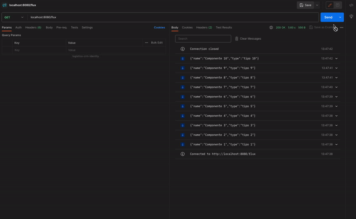

# POC de validação e entendimento da estrutura de stream sobre HTTP/2

### Exemplo de resposta obtida:


#### Para executar o projeto, utilize a linha
```
./gradlew bootRun
```
#### CURL para request
```
curl --location 'localhost:8080/flux'
```